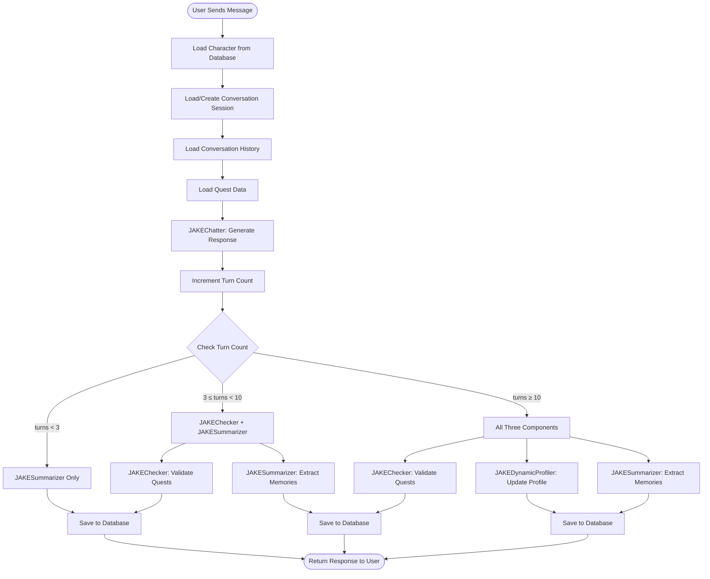

# JAKE System Architecture

## Overview

The JAKE system is an AI chatting pipeline for custom characters (자캐 - 자기 캐릭터) featuring:
- Dynamic character generation
- Rich conversational interactions
- Quest-based progression system
- Adaptive character profiles
- Long-term semantic memory

### Technology Stack

- **LangChain**: LLM integration and chains
- **LangGraph**: State machine orchestration
- **FastAPI**: REST API endpoints
- **SQLAlchemy**: Relational database (characters, conversations, quests)
- **ChromaDB**: Vector database (semantic memory)

### Terminology

- **Turn**: One complete user-assistant exchange (2 messages)
- **Affection Score**: Numeric value (0-100) tracking relationship closeness
- **Quest**: Objective or milestone in character interaction
- **Advancement Quest**: Special quest that unlocks new relationship stages

---

## System Diagram

```
┌─────────────────────────────────────────────────────────┐
│                     FastAPI Server                       │
│                      (src/main.py)                       │
└───────────┬─────────────────────────────────┬───────────┘
            │                                 │
            ▼                                 ▼
    ┌───────────────┐              ┌────────────────────┐
    │ JAKEOrchestrator│              │  Database Layer    │
    │  (LangGraph)   │◄────────────►│  (SQLAlchemy)      │
    └────────┬───────┘              │  - Character       │
             │                      │  - Conversation    │
     ┌───────┴────────┐             │  - Message         │
     │  PromptManager │             │  - Quest           │
     │  (Centralized) │             │  - Memory          │
     └────────────────┘             └────────────────────┘
             │                               │
     ┌───────┴──────────────────┐           │
     │   5 Core Agents          │           │
     │  ┌─────────────────────┐ │           ▼
     │  │ 1. JAKECreator      │ │   ┌──────────────────┐
     │  │ 2. JAKEChatter      │ │   │  Vector Store    │
     │  │ 3. JAKEChecker      │ │   │  (ChromaDB)      │
     │  │ 4. JAKEDynamicProfiler│   │  - Embeddings    │
     │  │ 5. JAKESummarizer   │ │   │  - Semantic      │
     │  └─────────────────────┘ │   │    Search        │
     └──────────────────────────┘   └──────────────────┘
```

---

## Process Flow

### Phase 1: Character Creation
1. **User provides basics** → name, age, occupation, additional_info
2. **JAKECreator generates**:
   - Worldview (setting, era, context)
   - Detailed traits (personality, speaking style, likes, dislikes, background, goals)
3. **Save to database** → `Character` table

### Phase 2: Conversation Session
4. **Load character** → Retrieve from database by `character_id`
5. **Load/Create session** → Get existing conversation or create new `session_id`
6. **Load context**: History, quests, affection score, dynamic profile

### Phase 3: Chat Generation
7. **JAKEChatter processes message** and returns:
   - `dialogue`: Character's spoken words
   - `action`: Physical actions/expressions
   - `situation`: Scene description
   - `background`: Atmosphere/environment
   - `affection_score`: Updated affection (0-100)
   - `affection_change`: Delta (-10 to +10)
   - `internal_thought`: Character's unspoken thoughts

### Phase 4: Post-Chat Processing (Conditional)

Orchestrated by LangGraph state machine:

| Turn Count | Components Run |
|------------|----------------|
| < 3 | JAKESummarizer only |
| 3-9 | JAKEChecker + JAKESummarizer |
| ≥ 10 | JAKEChecker + JAKEDynamicProfiler + JAKESummarizer |

### Phase 5: Database Updates
- Save messages to `Message` table
- Update `Conversation.affection_score`
- Update `Quest.cleared` status
- Update `Character.dynamic_profile` (if applicable)
- Store memories in vector database

### Phase 6: Response
Return complete response with dialogue, actions, affection, quest status, and memory count.

---

## Flow Diagram



---

## LangGraph State Machine

The orchestration is managed by `JAKEOrchestrator`:

```
[Chat Node] → [Decision Node based on turn_count]
    ├─→ [Summarize Node] → END
    ├─→ [Check Quests Node] → [Summarize Node] → END
    └─→ [Check Quests Node] → [Update Profile Node] → [Summarize Node] → END
```

### State Schema

```python
class ConversationState(TypedDict):
    # Input
    user_message: str
    character: Dict[str, Any]
    history: List[Dict[str, str]]
    regular_quests: Dict[str, Any]
    advancement_quests: Dict[str, Any]
    current_affection: int
    relationship_stage: str
    turn_count: int

    # Output
    response: Dict[str, Any]
    updated_quests: Dict[str, Any]
    updated_dynamic_profile: str
    memories: Dict[str, List[str]]
    updated_affection: int
```

---

## Connection Architecture

### Request → Response Flow

```
1. HTTP POST /characters/1/chat {"message": "Hello!"}
   ↓
2. FastAPI endpoint receives request
   ↓
3. Load character from database
   ↓
4. Load conversation session (or create new)
   ↓
5. Load conversation history and quests
   ↓
6. Call orchestrator.process_message()
   ↓
7. Orchestrator invokes LangGraph state machine:
   │
   ├─> chat_node() → JAKEChatter.chat()
   │       └─> PromptManager.get_chat_prompt()
   │           └─> OpenAI GPT-4o → Returns response
   │
   ├─> route_after_chat() [decides based on turn_count]
   │
   ├─> check_quests_node() [if applicable]
   │
   ├─> update_profile_node() [if applicable]
   │
   └─> summarize_node() → Extract memories
   ↓
8. Save everything to database and vector store
   ↓
9. Return JSON response to user
```

### Key Connection Points

**FastAPI Initialization** (`src/main.py`):
```python
orchestrator = JAKEOrchestrator()  # Connects all agents
vector_store = VectorMemoryStore()  # Vector DB connection
```

**Orchestrator** (`src/agents/jake_orchestrator.py`):
```python
class JAKEOrchestrator:
    def __init__(self):
        self.creator = JAKECreator()
        self.chatter = JAKEChatter()
        self.checker = JAKEChecker()
        self.profiler = JAKEDynamicProfiler()
        self.summarizer = JAKESummarizer()
        self.graph = self._build_graph()
```

**Agent → PromptManager**:
```python
# Every agent uses centralized prompts
self.prompt_manager = PromptManager()
prompt = self.prompt_manager.get_chat_prompt()
chain = prompt | self.llm | parser
```

---

## Extending the System

### Add a New Agent

1. **Create agent file**: `src/agents/jake_newagent.py`
```python
from src.prompts import PromptManager

class JAKENewAgent:
    def __init__(self):
        self.llm = ChatOpenAI(...)
        self.prompt_manager = PromptManager()

    def process(self, input_data):
        prompt = self.prompt_manager.get_new_prompt()
        return (prompt | self.llm | parser).invoke(input_data)
```

2. **Add prompt**: `src/prompts/newagent_prompts.py`

3. **Update PromptManager**: Add `get_new_prompt()` method

4. **Add to Orchestrator**:
```python
self.new_agent = JAKENewAgent()
workflow.add_node("new_node", self._new_node)
```

### Add a New Endpoint

```python
@app.get("/characters/{character_id}/stats")
async def get_character_stats(character_id: int, db: Session = Depends(get_db_session)):
    character = db.query(Character).filter(Character.id == character_id).first()
    # ... implementation
    return {"character_id": character_id, ...}
```

---

## Implementation Files

| File | Purpose |
|------|---------|
| `src/agents/jake_creator.py` | Character generation |
| `src/agents/jake_chatter.py` | Conversation handling |
| `src/agents/jake_checker.py` | Quest validation |
| `src/agents/jake_dynamic_profiler.py` | Profile updates |
| `src/agents/jake_summarizer.py` | Memory extraction |
| `src/agents/jake_orchestrator.py` | LangGraph orchestration |
| `src/main.py` | FastAPI endpoints |
| `src/models/schemas.py` | Database schemas |
| `src/utils/vector_store.py` | ChromaDB integration |
| `src/prompts/` | Centralized prompt management |
