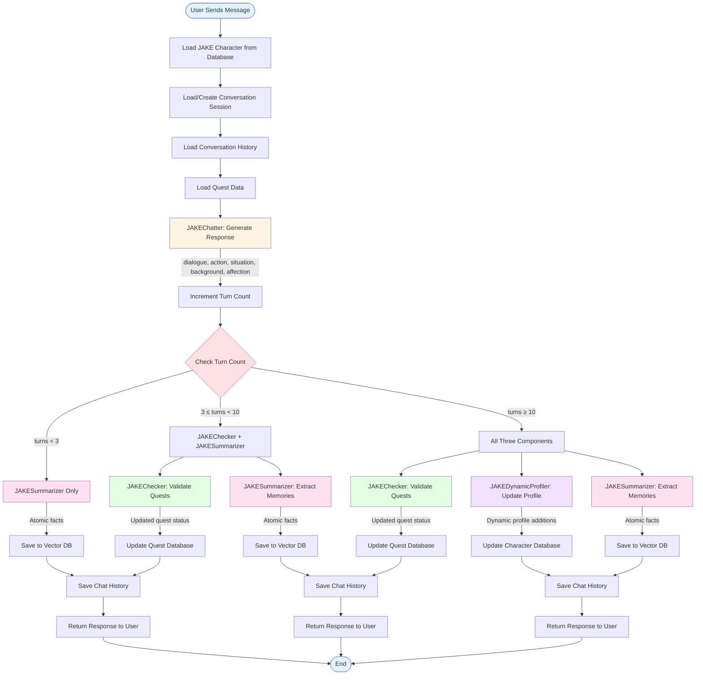

# JAKE Chatting Flow Diagram

This diagram visualizes the chatting pipeline process defined in PLAN.md.

## Detailed Flow Description

### 1. Initialization Phase
- User sends a message
- System loads JAKE character from database
- Loads or creates conversation session
- Retrieves conversation history and quest data

### 2. Chat Generation (Always Runs)
- **JAKEChatter** generates rich response:
  - Dialogue (what character says)
  - Action (physical actions/expressions)
  - Situation (scene description)
  - Background (atmosphere)
  - Affection score and change

### 3. Post-Chat Processing (Conditional)

#### Turn Count < 3
- **JAKESummarizer only**: Extract atomic facts for memory

#### Turn Count 3-9
- **JAKEChecker**: Validate quest completion
- **JAKESummarizer**: Extract atomic facts

#### Turn Count ≥ 10
- **JAKEChecker**: Validate quest completion
- **JAKEDynamicProfiler**: Update character profile with new traits
- **JAKESummarizer**: Extract atomic facts

### 4. Database Updates
- Quest statuses updated
- Character dynamic profile updated (if applicable)
- Memories embedded and saved to vector database
- Chat history saved to SQL database

### 5. Response
- Return complete response to user with:
  - Dialogue and actions
  - Updated affection score
  - Quest completion status
  - Memory extraction count

## LangGraph State Machine

The orchestration is managed by a LangGraph state machine in `src/agents/jake_orchestrator.py` that automatically routes between nodes based on turn count.
