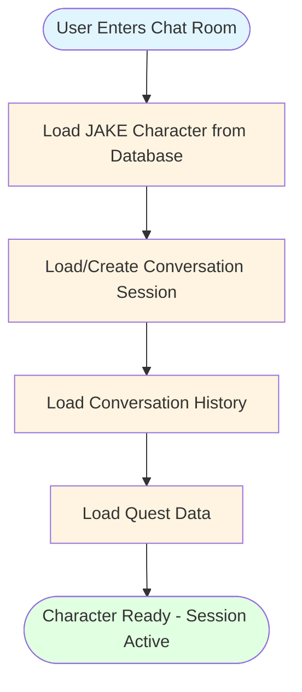

# JAKE Chatting Flow Diagram

This diagram visualizes the chatting pipeline process defined in PLAN.md.

## Flow 1: Enter Chat Room (Load Character)

This flow occurs **once** when a user enters a chat room with a character.

---

## Flow 2: Chatting with Character (Message Loop)

This flow occurs **for each message** within an active chat session.

---

## Sequence Diagram (Detailed View)

This sequence diagram shows the interaction between components with concurrent post-processing.

---

## Detailed Flow Description

### Flow 1: Enter Chat Room

#### 1.1 Character Loading (One-time)
- User selects a character and enters the chat room
- System loads JAKE character (created by JAKECreator) from database
- Loads or creates conversation session for this user-character pair
- Retrieves existing conversation history
- Loads quest data associated with this character

#### 1.2 Session State
- Character data is cached in active session
- Subsequent messages don't require character reload
- Session remains active until user exits chat room

---

### Flow 2: Message Loop

#### 2.1 Chat Generation (Always Runs)
- **JAKEChatter** generates rich response:
  - Dialogue (what character says)
  - Action (physical actions/expressions)
  - Situation (scene description)
  - Background (atmosphere)
  - Affection score and change

#### 2.2 Post-Chat Processing (Concurrent Async Workers)

All applicable workers run **concurrently** using async wrappers:

| Turn Count | Active Workers |
|------------|----------------|
| < 3 | JAKESummarizer only |
| 3 - 9 | JAKEChecker + JAKESummarizer |
| ≥ 10 | JAKEChecker + JAKEDynamicProfiler + JAKESummarizer |

**Worker Details:**
- **JAKEChecker**: Validates quest completion status
- **JAKEDynamicProfiler**: Updates character profile with newly discovered traits
- **JAKESummarizer**: Extracts atomic facts for long-term memory

#### 2.3 Database Updates (After Workers Complete)
- Quest statuses updated in SQL DB
- Character dynamic profile updated in SQL DB (if applicable)
- Atomic facts embedded and upserted to Vector DB
- Chat history saved to SQL DB

#### 2.4 Response
- Return complete response to user with:
  - Dialogue and actions
  - Updated affection score
  - Quest completion status
  - Memory extraction count

---

## LangGraph State Machine

The orchestration is managed by a LangGraph state machine in `src/agents/jake_orchestrator.py` that:
- Manages session state and character context
- Routes between nodes based on turn count
- Executes post-processing workers concurrently using `asyncio.gather()`
